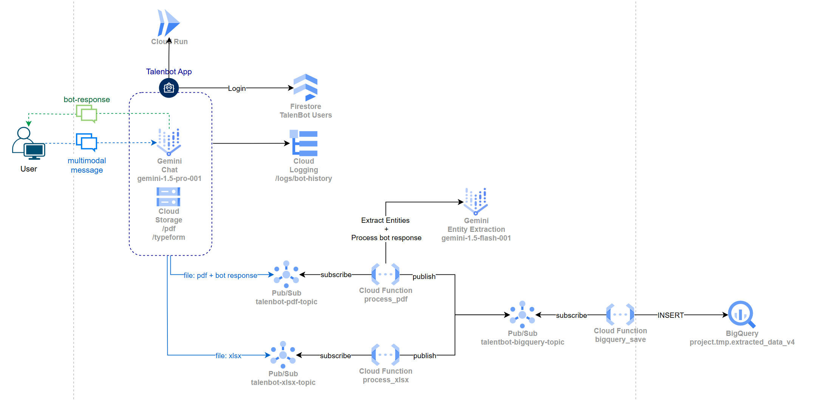
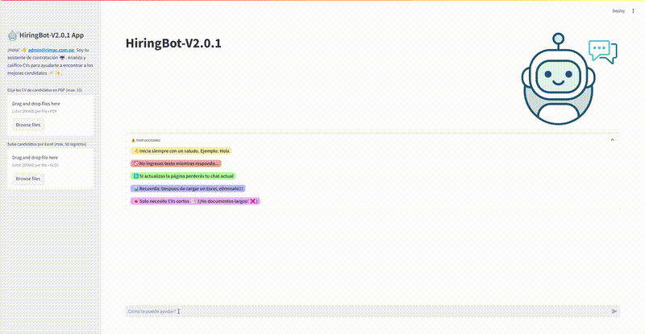

# Hiring Bot

Chatbot in GCP to analyze candidate CVs for sales advisor positions. This solution aimed to streamline recruitment processes, reduce time-to-hire, and select top prospects with high retention and productivity potential. The system utilized techniques such as prompt engineering, Retrieval-Augmented Generation (RAG), and fine-tuning.

## Architecture



## Demo



## Setup
- Install Pipenv
- Update .env file

## Run locally

1. Create a service account file: llm.json
2. Install dependencies using pipenv
   ```bash
   pipenv install
   ```
3. Run the server
    ```shell
   # With pipenv
   pipenv run streamlit run app.py

   # With streamlit
   streamlit run app.py
    ```


## Deploy to Cloud Run
0. Configure service account for project POC
   ```bash
    gcloud auth activate-service-account <service-account> --key-file=<key-file.json> --project=<project-name>
    ```
    
1. Update lock file
    ```bash
    pipenv lock 
    ```
2. Create requirements.txt
    ```shell
    pipenv run pip freeze > requirements.txt
    ```

3. Deploy
    ```shell
    gcloud run deploy talentbot-v2-poc --allow-unauthenticated --region us-east4 --service-account <service-account> --source . --memory=2Gi --cpu=1 --concurrency=5 --timeout=300
    ```
    ** Retry step 0 if fails

    

## Update resources
```shell
gcloud run services update talentbot-v2-poc --memory=2Gi --cpu=1 --concurrency=5 --region=us-east4 --timeout=300
```


